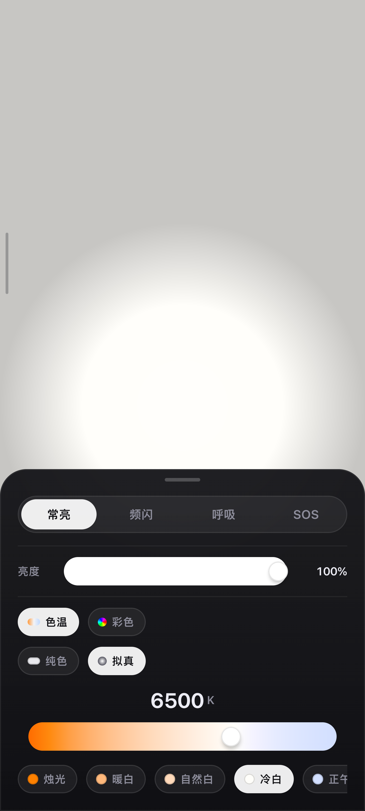
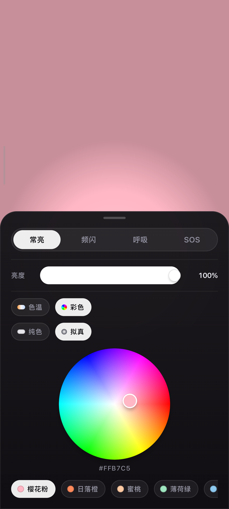
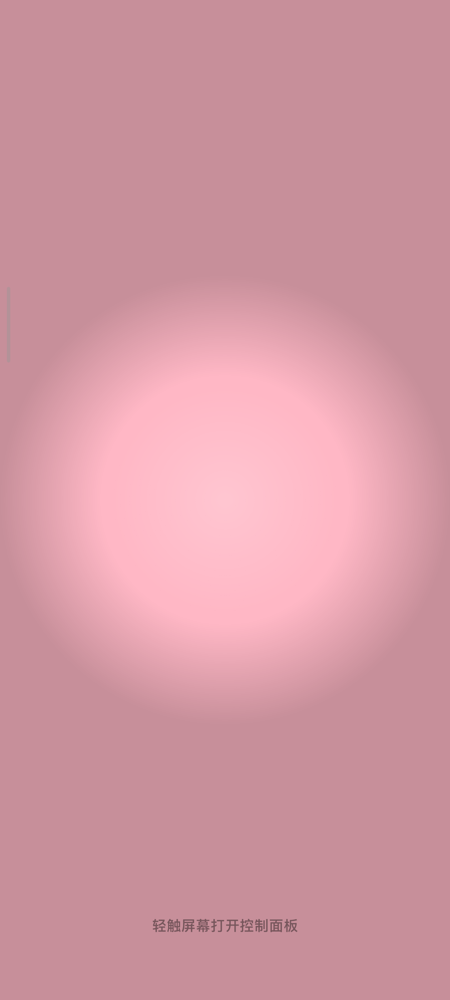
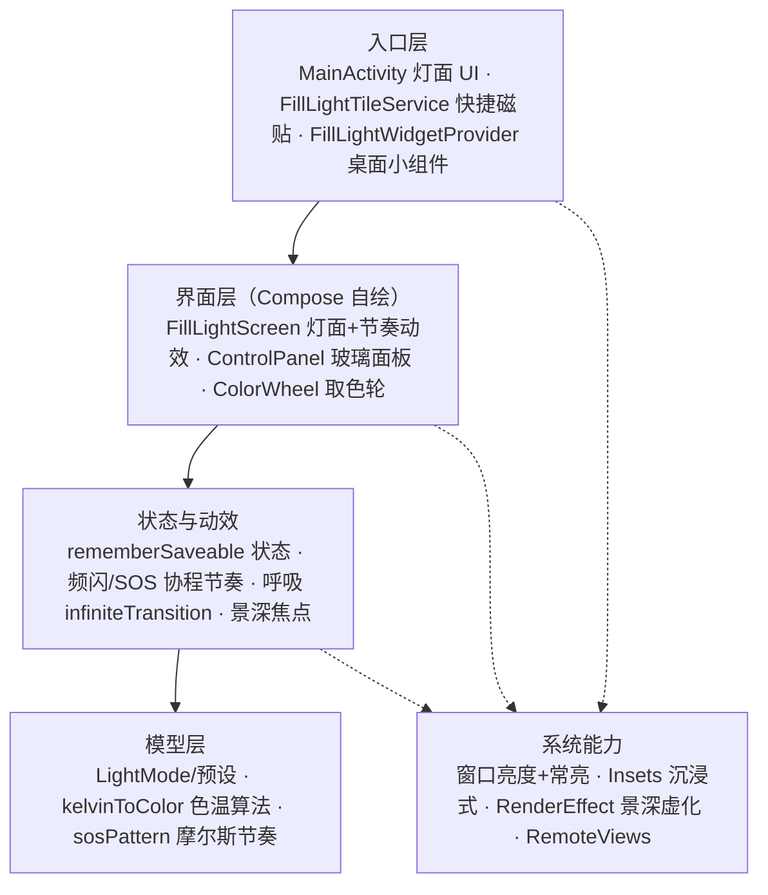

<p align="center">
  <strong>把手机屏幕变成一盏可调色的灯</strong> · v1.0.0 已发布（2026-10-07）
</p>

<h1 align="center">FillLight 补光灯</h1>

<p align="center">
  自拍补光 · 视频打光 · 氛围夜灯 · 应急照明——<br>
  一块屏幕全搞定：<strong>色温 / 取色轮 / 频闪 / 呼吸 / SOS</strong>，iOS 式玻璃景深控制面板。
</p>

<p align="center">
  <a href="https://github.com/zh-hanlabs/FillLight/stargazers"></a>
  <a href="https://github.com/zh-hanlabs/FillLight/releases"></a>
  <a href="https://github.com/zh-hanlabs/FillLight/releases/tag/v1.0.1"></a>
  <a href="https://kotlinlang.org/"></a>
  <a href="https://developer.android.com/compose"></a>
  <a href="https://developer.android.com/about/versions/oreo"></a>
  <a href="https://github.com/zh-hanlabs/FillLight/commits/main"></a>
</p>

<p align="center">
  🌡️ 色温 1500K–9000K · 🎨 HSV 取色轮 · ✨ 拟真光衰减 · ⚡ 频闪 0.5–10Hz · 🫁 呼吸 · 🆘 SOS · 🧩 磁贴+小组件 · 🔒 零权限零网络
</p>

<p align="center">
  ⭐ 如果 FillLight 对你有帮助或启发，欢迎 <a href="https://github.com/zh-hanlabs/FillLight/stargazers"><strong>Star 项目</strong></a>；APK 可直接从 <a href="https://github.com/zh-hanlabs/FillLight/releases"><strong>Releases</strong></a> 下载安装。
</p>

---

**FillLight** 是一款「屏幕补光灯」工具：打开即全屏亮灯，屏幕就是光源——不做拍照、不做滤镜，只把「打光」这一件事做顺手。界面上没有用一个 Material 默认控件，全部自绘，并做了 iOS 控制中心式的玻璃景深交互：**按住谁谁浮起，其余退焦**。

[效果演示](#demo) · [核心能力](#capabilities) · [实现明细](#details) · [架构](#architecture) · [快速上手](#quickstart) · [下载安装](#download)

> [!IMPORTANT]
> **安装提示**：APK 为 debug 签名包，下载后直接点开安装（要求 Android 8.0+）。小米/澎湃OS 等机型若被拦截：关闭应用商店「纯净模式」，或给来源应用授予「安装未知应用」权限——静默闪退即是被拦截，不是包损坏。

<a id="capabilities"></a>

## ✨ 核心能力

| 能力 | 说明 |
|---|---|
| 全屏补光 | 整屏变灯板，屏幕常亮；App 内亮度独立调节（覆盖窗口亮度，不动系统设置），灯面铺满摄像头挖孔区 |
| 色温连续可调 | 1500K（烛光暖黄）~ 9000K（冷白）渐变滑轨 + 大号等宽数字读数；预设：烛光 / 暖白 / 自然白 / 冷白 / 正午 |
| 任意取色 | 自绘 HSV 取色轮：中心白、边缘全色相，点按/拖动取色，实时显示 HEX 值；旋钮实心显示当前颜色 |
| 氛围色预设 | 樱花粉、日落橙、蜜桃、薄荷绿、海盐蓝、薰衣草、青柠、玫瑰金，一键切换 |
| 四种灯光模式 | 常亮 / 频闪（0.5–10 Hz 可调）/ 呼吸（明暗起伏）/ SOS（标准摩尔斯节奏求救灯） |
| 两种灯面风格 | **拟真**：中心亮、四角暗的真实光衰减；**纯色**：平涂满屏（手电/最高照度场景） |
| 玻璃景深面板 | 全自绘控件（胶囊滑条 / 滑块模式切换器 / 预设胶囊）；按住任意控件弹性放大，其余区块虚化压暗退焦，松手回焦 |
| 实时跟色 | 按住取色轮或色温条时灯光零延迟跟随（动画切即时模式），松手、点预设恢复平滑过渡 |
| 沉浸式全屏 | 隐藏状态栏/导航栏，边缘轻滑临时唤出；转屏不闪灯，返回键先收面板 |
| 快捷入口 | 下拉快捷设置「补光灯」磁贴 + 桌面 1x1 小组件，一键直达灯面 |
| 克制与安全 | **零权限、零网络、零第三方 SDK**；状态随进程恢复，杀掉重开不丢设置 |

<a id="details"></a>

<details>
<summary><strong>功能实现明细（点开查看）</strong></summary>

- **色温 → RGB**：Tanner Helland 算法（1500K–9000K），滑轨即色温本身——渐变轨道按色温采样渲染，滑到哪就是哪的颜色
- **HSV 取色轮**：Compose Canvas 自绘，`sweepGradient` 色相环 + `radialGradient` 白心叠加；指针位置 `atan2` 反解色相、半径映射饱和度；旋钮位置由当前颜色反算 HSV 得到
- **实时跟色**：按住取色轮/色温条期间把颜色动画切换为 `snap()`（即时模式），松手切回 220ms `tween` 过渡——拖动不滞后、点选仍有质感
- **灯光节奏**：频闪与 SOS 由协程驱动（SOS 为标准摩尔斯节奏：点 220ms / 划 660ms / 字间隔 660ms / 循环停顿 1.8s）；呼吸灯用 `infiniteTransition` 正反向渐变
- **景深交互**：面板级焦点状态（`PanelFocusState`）——控件按住时上报焦点，自身弹簧放大（dampingRatio 0.55 轻微过冲），其余区块 `blur(4dp)` + 亮度 65% 退焦；虚化走 RenderEffect（Android 12+ 硬件加速，低版本自动降级为只压暗）
- **全自绘控件**：模式切换为「胶囊轨道 + 白色滑块」弹簧滑动；滑条为粗胶囊轨道（亮度/频率白色填充、色温整条渐变）+ 投影手柄；预设胶囊选中态白底黑字——面板内无一个 Material 默认控件
- **沉浸式**：`WindowInsetsController` 隐藏 systemBars，`BEHAVIOR_SHOW_TRANSIENT_BARS_BY_SWIPE` 边缘滑出；`SHORT_EDGES` 铺满挖孔区；`configChanges` 承接转屏，灯面不闪
- **亮度控制**：`window.screenBrightness` 仅覆盖本 App 窗口（0.05–1.0），系统亮度不受影响；`FLAG_KEEP_SCREEN_ON` 常亮
- **状态恢复**：全部设置 `rememberSaveable`，进程被杀重开不丢；触感反馈（点选胶囊/切模式）
- **快捷入口**：`TileService`（ACTIVE_TILE）点击直达；桌面小组件 `RemoteViews` + PendingIntent，无障碍描述齐全

</details>

<a id="demo"></a>

## 🎬 效果演示

打开即亮灯：整屏就是光源。下方控制面板收放自如——轻触屏幕收起，就是一块纯净的灯面。



> 图 1 · 色温模式：拟真灯面 + 6500K 冷白。渐变滑轨上滑到哪就是哪个色温，大号等宽数字实时读数；模式切换器为白色滑块胶囊。



> 图 2 · 彩色模式：HSV 取色轮（樱花粉 #FFB7C5），旋钮实心显示当前颜色，氛围色预设一键直达；按住轮子取色时灯光实时跟随。



> 图 3 · 面板收起后：纯灯面状态，中心亮四角暗的拟真光衰减；轻触任意位置唤回面板。

<a id="architecture"></a>

## 🏗️ 架构

**四层主链 + 系统能力层**——单 Activity + Compose，无网络无存储，每一层只回答一个问题：



| 层 | 位置 | 回答的问题 | 铁律 |
|---|---|---|---|
| 入口层 | `MainActivity` / `FillLightTileService` / `FillLightWidgetProvider` | 从哪进 | 三个入口同达灯面，零权限 |
| 界面层 | `FillLightScreen` / `ControlPanel` / `ColorWheel` | 显示什么、怎么交互 | 全自绘控件，不用 Material 默认件 |
| 状态与动效 | Compose State + 协程 / `infiniteTransition` | 灯怎么亮 | 状态可恢复；动效不过度 |
| 模型层 | `LightModel.kt` | 颜色怎么算 | 纯函数，可独立测试 |
| 系统能力 | Window / Insets / RenderEffect / RemoteViews | 怎么用系统 | 只用窗口级 API，零敏感权限 |

<a id="quickstart"></a>

## 🚀 快速上手

```bash
git clone https://github.com/zh-hanlabs/FillLight.git
cd FillLight
./gradlew :app:assembleDebug
# 产物：app/build/outputs/apk/debug/app-debug.apk
adb install app/build/outputs/apk/debug/app-debug.apk
```

或直接用 Android Studio 打开本目录，选择设备点 Run。Gradle wrapper 8.13 随仓库提供，克隆即构建（国内网络已内置阿里云镜像配置）。

<a id="download"></a>

## 📥 下载安装

前往 [Releases](https://github.com/zh-hanlabs/FillLight/releases) 下载最新 APK（当前 `FillLight-v1.0.1-debug.apk`）：

- 要求 **Android 8.0（API 26）** 及以上
- debug 签名包，下载后点开安装即可
- 安装被静默拦截（点击安装闪一下就退）？见顶部「安装提示」

## 🗺️ 版本

| 版本 | 日期 | 说明 |
|---|---|---|
| v1.0.1 | 2026-10-07 | 色温 K 值手动输入；亮度/频率滑条去手柄（胶囊填充即指示）；修复手柄端点越界与对比度 |
| v1.0.0 | 2026-10-07 | 首版：全屏补光 / 色温 / 取色轮 / 氛围预设 / 四种灯光模式 / 纯色·拟真灯面 / 玻璃景深面板 / 沉浸式全屏 / 磁贴+小组件 |
